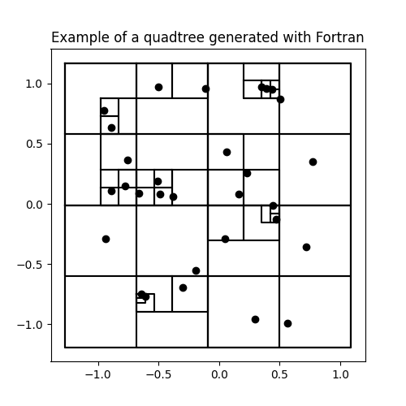

# hierarquicos

Estudo de métodos hierárquicos para N-corpos. Para começar, estou mexendo com Barnes-Hut.

# Barnes-Hut

Implementado em Python no diretório `srcpy`, e em Fortran no diretório `fortran`. A princípio, parece funcionar nos conformes. Vamos ver. Estou seguindo a referência [1].

---

# Referências

[1] Pfalzner, Susanne; Gibbon, Paul (1996). _Many-body tree methods in physics_. Cambridge [u.a.]: Cambridge Univ. Press. ISBN 978-0-521-49564-6.