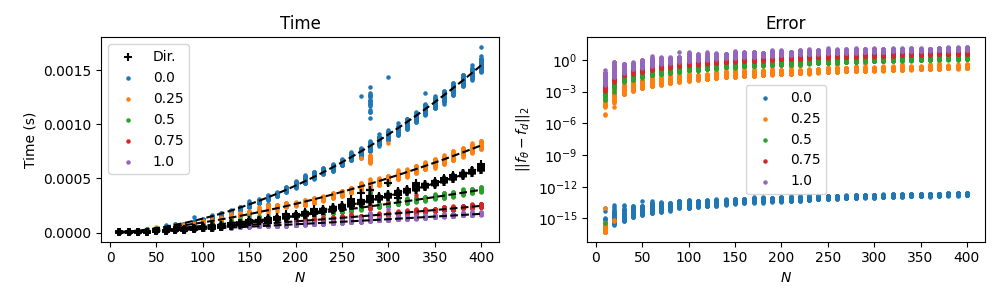
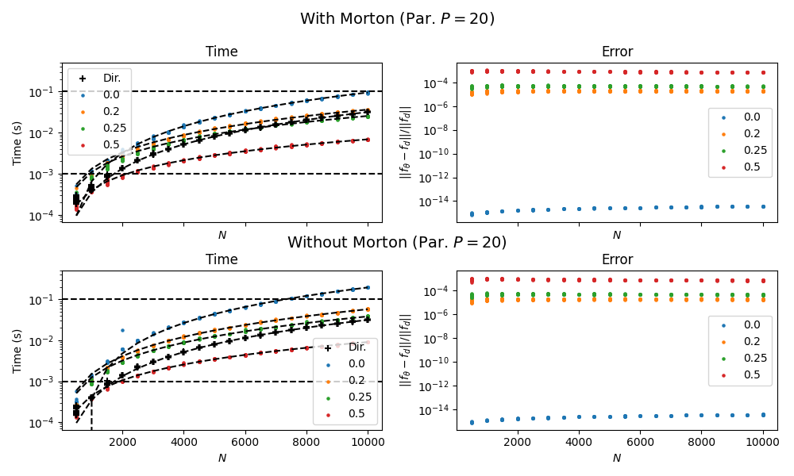

# hierarquicos

Estudo de métodos hierárquicos para N-corpos. Para começar, estou mexendo com Barnes-Hut.

# Barnes-Hut

Implementado em Python no diretório `srcpy`, e em Fortran no diretório `fortran`. A princípio, parece funcionar nos conformes. Vamos ver. Estou seguindo a referência [1].

Fiz algumas mudanças para melhorar a performance, sem usar ponteiros e todas essas coisas. Parece ok.

> seria bom dar uma olhada melhor nesse negócio da ordenação de Morton, parece que dá para construir a árvore bem mais rápido usando isso.




## Atualização: Sim, Morton é bom

Implementei o método usando Morton + quadrupolos, e o desempenho saiu melhor que a implementação anterior, que era intuitiva apenas.



---

# Parareal

Pela dificuldade de lidar com o pymgrit, decidi implementar o Parareal na marra, e parece que deu certo! Veja o exemplo de saída rodando o Parareal com Barnes-Hut vs Parareal direto vs sequencial para um problema de 1000 corpos:

```
========================================
> PARAREAL (barnes-hut)

Iter.:   2 / Error:  8.7906E-08 / Time:  9.6131E+00
Iter.:   3 / Error:  6.7169E-13 / Time:  9.5865E+00
Iter.:   4 / Error:  4.5642E-18 / Time:  9.7123E+00
Iter.:   5 / Error:  2.3763E-23 / Time:  9.6458E+00

 Max Error Accep.  1.0000E-20
      Final error  2.3763E-23
       Total time     38.5577 s
========================================

========================================
> PARAREAL (direct)

Iter.:   2 / Error:  7.9081E-08 / Time:  2.7627E+01
Iter.:   3 / Error:  3.2318E-13 / Time:  2.7807E+01
Iter.:   4 / Error:  2.0077E-18 / Time:  2.7397E+01
Iter.:   5 / Error:  1.1338E-23 / Time:  2.7517E+01

 Max Error Accep.  1.0000E-20
      Final error  1.1338E-23
       Total time    110.3487 s
========================================

========================================
> SEQUENTIAL

||Par. - Seq.|| =   5.6046E-29
     Total time =     155.3652 s
```

---

# Referências

[1] Pfalzner, Susanne; Gibbon, Paul (1996). _Many-body tree methods in physics_. Cambridge [u.a.]: Cambridge Univ. Press. ISBN 978-0-521-49564-6.