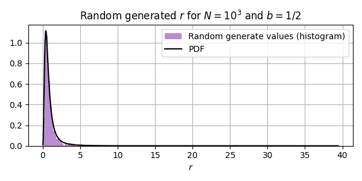
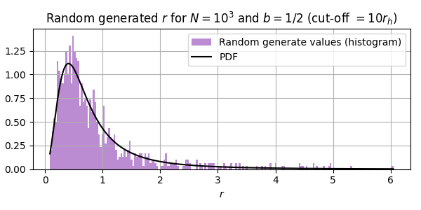
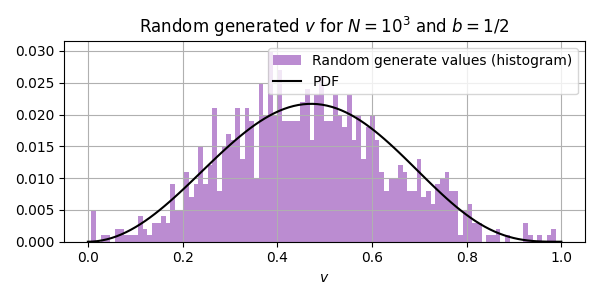

# How to generate initial values

To generate initial values like another N-body-ers usually do, we can use the Galactic Python [*galpy*](https://docs.galpy.org/en/stable) package.

## Plummer density profile

The most common density profile is the *Plummer profile* (Plummer, 1911) given by

$$
\rho(r) = \dfrac{3 M b^2}{4 \pi} (r^2 + b^2)^{5/2},
$$

where $M$ is the total masses of the system and $b$ is the *Plummer length/scale*. It relates to the half-mass radius $r_h$ (i.e. the radius that contains a total mass of $M/2$) as $r_h \approx 1.3 b$.

The correspondent potential is given by:

$$
\Phi(r) = - \dfrac{G M}{\sqrt{r^2 + b^2}},
$$

where $M$ is the total mass of the system. The use of a $\varepsilon$ as a softening to the Newton's classical potential is related directly to this density profile.

To generate random radius $r$ with this density we can just define the CDF (in spherical coordinates):

$$
P(r) = \dfrac{M(\lt r)}{M} = \dfrac{4 \pi}{M} \int_0^r \rho(q) q^2 dq,
$$

generate a random $X_1 \sim U[0,1]$ and solve $P(r) = X_1$. In this case specifically we can obtain $P^{-1}(X_1)$ explicitly:

$$
r = P^{-1}(X_1) = \dfrac{b}{\sqrt{X_1^{-2/3} - 1}}.
$$

> (Aarseth, 2003) suggests to use a rejection parameter to reject rare large values (e.g. $r > 10 r_h$).


We can guarantee that we are generating values with the correct distribution we can obtain the PDF for the Plummer profile:

$$
p(r) = \dfrac{dP(r)}{dr} = \dfrac{3 b^2 r^2}{(b^2 + r^2)^{5/2}}.
$$

To generate the positions $(x,y,z)$ we just generate two more $X_2, X_3 \sim U[0,1]$ and define

$$
z = (1 - 2 X_2)r
$$

$$
x = \sqrt{r^2 - z^2} \cos{2 \pi X_3},
$$

$$
y = \sqrt{r^2 - z^2} \sin{2 \pi X_3}.
$$

The theory to generate velocities is a bit more complex and I don't understand it very well yet, so I'll not write it here. I'm using (Bovy, 2026) to learn it. The basic idea is:

1. We need to find some $f(x,v)$ that respect the collisionless Boltzmann equation. In fact we have:

$$
\rho(\vec x) = \int f(\vec x, \vec v) \ d^3 v.
$$

2. If we suppose initial equilibrium (in some sense), $\partial f / \partial t = 0$. By the Jeans Theorem, $f$ depends only on the first integrals of the system, and if the system is spherically isotropic, it depends only on the specific energy:

$$
E(x, v) = \dfrac{1}{2} v^2 + \Phi(x).
$$

3. To find $f(E)$ we use the Eddington inversion formula.

4. With $f(E)$ we generate $0 \leq v \leq v_{escape}$, with $v_{escape} = \sqrt{- 2 \Phi(r)}$, with probability $p(v | r) \propto v^2 f(E)$.

Ignoring the unknow (for now) origin of these things, the Edding inversion formula gives:

$$
f(\vec x, \vec v) = \dfrac{24 \sqrt{2}}{7 \pi^3} \dfrac{b^2}{G^5 M^4} (-E(\vec x, \vec v))^{7/2} \equiv f(E).
$$

Considering a volume element in the velocity space between $v$ and $dv$, we have 

$$
p(v | r) \propto 4 \pi v^2 f(E) dv.
$$

Using the value of $E$, we get

$$
p(v | r) \propto v^2 \left(-\dfrac{v^2}{2} - \Phi(r)\right)^{7/2}.
$$

Let's suposse that we don't want particles with a velocity bigger than the escape velocity $v_{esc}(r) = \sqrt{- 2 \Phi(r)}$. Defining $q := v/v_{esc} \in [0,1]$, we can rewrite the probability:

$$
p(v | r) \propto q^2 (1 - q^2)^{7/2} =: g(q).
$$

To generate a velocity given $r$, we need to use rejection (von Neumann). First, $g(q)$ has a global maximum (as $q \geq 0$) at $q_{max} = \sqrt{2}/3$, with $g(q_{max}) \approx 0.0922 $. Now we do:

1. Generate $q \sim U[0,1]$.
2. Generate $y = g(q_{max}) \cdot y_0$, with $y_0 \sim U[0,1]$.
3. If $y \leq g(q)$, we accept and define $v = q \ v_{esc}$. If not, go to (1).

We can expect some properties of the generated initial values. First, the potential energy $V$ can be calculated with:

$$
V = \dfrac{1}{2} \int \rho(\vec x) \Phi(\vec x) d^3x = 2 \pi \int_0^\infty \rho(r) \Phi(r) r^2 dr = - \dfrac{3 \pi}{32} \dfrac{G M^2}{b}.
$$

As long as the function $f$ became from the Boltzmann Equation, we can expect the values to be virialized/in equilibrium:

$$
Q = - \dfrac{2 T}{V} = 1,
$$

where $T$ is the kinect energy. This means that

$$
T = \dfrac{3 \pi}{64}\dfrac{G M^2}{b}
$$

and the total energy is:

$$
E = - \dfrac{3 \pi}{64}\dfrac{G M^2}{b}.
$$

Obviously this is exact only with $N \to \infty$, but we can expected something nearly these values with finite $N$.


## Using galpy

To sample positions following the Plummer density with Galpy we need the modules `potential` and `df`:

```python
from galpy import potential, df

def plummer (N, b=1.0):
  pot = potential.PlummerPotential(amp=1.0, b=b, normalize=False)
  dfunc = df.isotropicPlummerdf(pot=pot)
  orbits = dfunc.sample(n=N)
  return orbits
```

With this variable `orbits` we can extract the positions and velocities by
```python
xs,   ys,  zs = orbits.x(),  orbits.y(),  orbits.z()
vxs, vys, vzs = orbits.vx(), orbits.vy(), orbits.vz()
```



> In fact, the cut-off parameter may be necessary to avoid outliers and get something bounded. Applying a rejection parameter we get "better" numbers:



To verify the velocities we need to get the random variables $q = v / v_{esc}$ instead of just $v$.

```python
rs = np.linalg.norm(qs, axis=1)
pot = potential.PlummerPotential(amp=1.0, b=b, normalize=False)
v_esc = np.sqrt(-2.0 * pot(rs,0))
qs = vs / v_esc
```

Normalizing the values to compare with the PDF, we get:



For the dynamic properties, we can see that $N=10^3$ is not really so much, but we have something near the expected:

```
Dynamical properties (||real - expected||):
Potential V: 0.006832137175154629
Kinect T:    0.00337158496224943
Total E:     0.010203722137404059
Virial Q:    0.022781918828791548
```

---

## References 

* Aarseth Sverre J. Gravitational N-Body simulations. Cambridge University Press (2003)
* Bovy J. Dynamics and Astrophysics of Galaxies. Princenton University Press (2026)
* Plummer H. On the problem of distribution in globular star clusters. Mon. Not. Roy. Astron. Soc. 71, 460–470 (1911).
